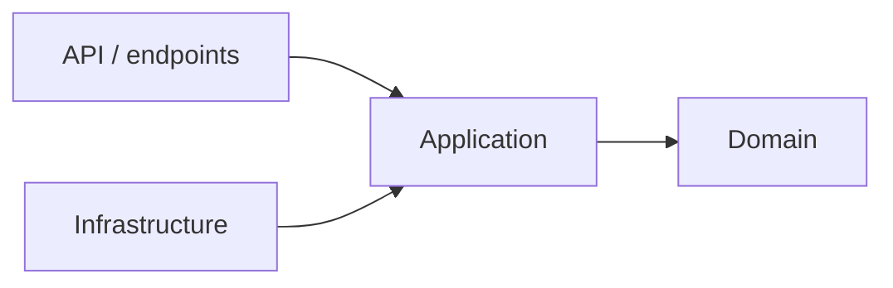

# Clean Architecture rules

Date: 2026-09-10

Madrid Intelligence Studio uses Clean Architecture in both backend and frontend. The goal is to keep football rules, use cases and user workflows independent from frameworks, database access, API-Football and UI details.

## Backend: .NET 10



| Layer | Responsibility | Cannot depend on |
|---|---|---|
| `Mis.Domain` | Football concepts, invariants and domain rules | EF Core, SQL Server, HTTP, API-Football, Next.js |
| `Mis.Application` | Commands, queries, use cases, DTO contracts and ports | SQL Server or provider SDKs |
| `Mis.Infrastructure` | EF Core, SQL Server, API-Football client, cryptography and implementations of ports | API endpoints or UI |
| `Mis.Api` | HTTP endpoint mapping, authentication, dependency composition and OpenAPI | Direct database/provider access outside registered application use cases |

Dependencies point inward. A fixture import endpoint calls an application use case; the use case depends on a provider port and a persistence port; Infrastructure implements them. Domain entities never expose API-Football payloads or EF Core persistence objects.

Projects appear only when the first feature needs them. Avoid a generic repository, generic service layer, interfaces for every class or empty future modules. Tests mirror the same boundary: Domain/Application unit tests, Infrastructure integration tests against SQL Server, and API contract tests.

## Frontend: Next.js

The Next.js App Router owns routes and composition, not business rules. Features are organized by user workflow instead of a single global component or service folder.

```text
apps/web/
├── app/                 # routes, layouts and server composition
├── features/
│   └── fixtures/        # UI, hooks and use cases for Match Center
├── entities/
│   └── fixture/         # domain-facing types and presentation mappings
├── infrastructure/
│   └── api/             # generated/typed .NET API client implementation
└── shared/              # reusable UI primitives and browser-independent utilities
```

The frontend reads data through typed API contracts. Components do not access SQL Server, API-Football tokens or arbitrary HTTP endpoints. Server Components fetch stable route data; Client Components are introduced only for user interaction such as manual refresh, pizarra or notebook entry. URL state comes before global state.

## First vertical slice

The first feature will be `RefreshFixtures` and `GetFixtures`:

1. API endpoint receives a manual refresh request.
2. Application use case validates the requested bounded scope.
3. Infrastructure calls API-Football and SQL Server through adapters.
4. Domain rules protect canonical fixture identity and provenance.
5. API returns explicit DTOs.
6. The Next.js fixtures feature renders the result and refresh state.

This keeps the same feature understandable from UI to database without allowing framework details to leak into core rules.
