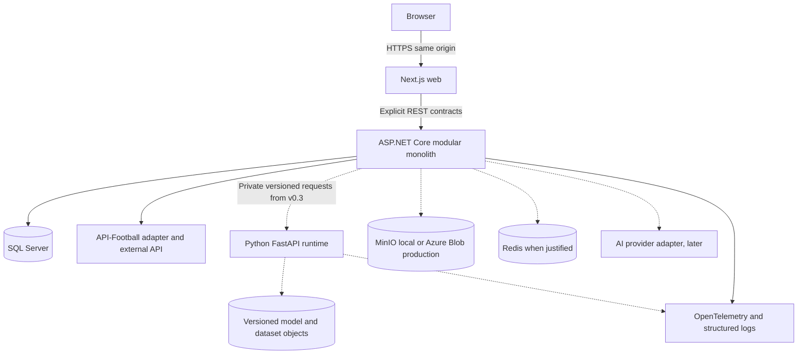

# Container view

Solid paths are needed by the first slice; dotted paths are deferred capabilities. The Next.js server forwards same-origin `/api` traffic to ASP.NET Core and does not duplicate business logic or authorization. Read data via server components where useful; interactive queries use typed clients and TanStack Query. URL state precedes server state and local component state; global stores require a use case.

## Deployment and code units

| Unit | Responsibility | Activation |
|---|---|---|
| `apps/web` | Next.js 16/React/TypeScript UI; Tailwind/shadcn; use forms, charts, Konva only as needed | v0.1 |
| `services/api` | .NET 10 API, orchestration, authorization and module-owned persistence | v0.1 |
| `services/ml` | Python/FastAPI feature computation, training, inference, evaluation, simulation | v0.3; boundary designed now |
| SQL Server | Canonical facts, ingestion audit and business records | v0.1 |
| Redis | Measured caching/coordination need with explicit invalidation | Deferred |
| Object storage | Large datasets, model artifacts, images/exports | First asset need |

This is a modular monolith plus one intentionally separate ML runtime. Refresh is initiated manually from the portal and audited by the API. Scheduling is deferred by ADR-017 until a real unattended-refresh requirement exists. No broker, distributed saga, Kubernetes, event sourcing, generic CQRS framework, or service mesh is planned.

Use module namespaces and feature folders first, with explicit module facades and architecture tests. Split assemblies only when enforcement or build isolation provides real value. EF Core is the default; Dapper read models require demonstrated query complexity. Pin actual dependencies and supported versions at implementation time; this document records AGENTS.md targets rather than package compatibility verification.
