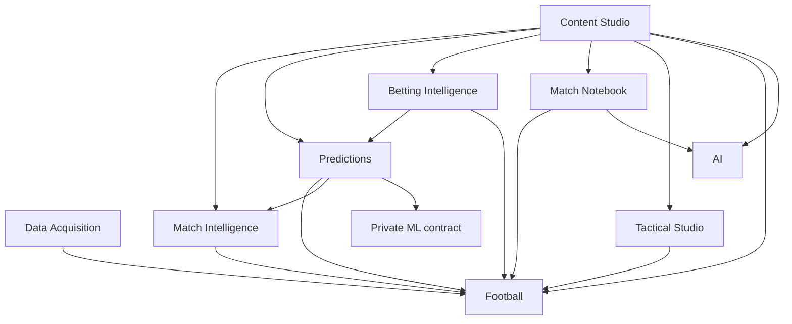

# Modules and dependency rules

Each module owns its business rules and tables. A module can read another module only through an explicit application contract returning DTOs; it cannot mutate or query another module's EF entities directly. References across modules use canonical IDs. Dedicated reporting projections can combine contract outputs; materialized cross-module SQL requires a documented ownership decision.

| Module | Owns | May consume | First needed |
|---|---|---|---|
| Football | Canonical teams, competitions, seasons, fixtures; later statistics, players, lineups | No other business module | v0.1 |
| Data Acquisition | Provider adapters, typed ID mappings, raw payloads, sync runs, errors, quota state | Football import facade | v0.1 |
| Match Intelligence | Descriptive metrics, form snapshots, evidence-backed analysis | Football read contracts | v0.2 |
| Predictions | Model registry metadata, feature snapshots, runs, immutable outputs, evaluation | Football evidence, Match Intelligence metrics, ML compute contract | v0.3 |
| Betting Intelligence | Bookmakers, timestamped odds, normalization, model/market value assessments | Predictions and Football references | v0.6 |
| Match Notebook | Original notes, revisions, tags, player references, clip candidates | Football; AI execution for grouping | v0.7 |
| Content Studio | Episodes, segments, scripts and revisions, talking points, assets | Football, Intelligence, Predictions, Betting, Notebook, Tactics, AI | v0.8 |
| Tactical Studio | Versioned scenes, normalized pitch geometry, formations and annotations | Football identities | v0.9 |
| AI | Provider adapters, prompt template versions, execution metadata | Provider ports only; callers supply evidence | v0.7 onwards |

Authentication/authorization, telemetry, time, and storage adapters are technical capabilities, not new football bounded contexts. Do not create a generic shared business model.

Arrows mean allowed consumer → dependency. Football cannot depend on Acquisition: Acquisition normalizes provider DTOs into Football-owned import requests. Intelligence cannot depend on Predictions. An application use case may combine Intelligence and AI results without creating an Intelligence↔AI dependency. Content owns links from segments to scenes; Tactics need not reference Content. Prevent cycles with architecture tests.

## Layers and transactions

Domain rules depend on neither EF, HTTP, provider DTOs, nor ML client libraries. Application slices define inputs, outputs, authorization, and orchestration. Infrastructure implements database/provider/compute ports. The API composition root wires dependencies; endpoint code invokes application use cases.

For v0.1 use one physical PostgreSQL database and one scoped EF Core context with separate `football` and `acquisition` configurations/schemas. Keep access through module facades; the shared context is an infrastructure transaction mechanism, not a license for arbitrary cross-module queries. One migration stream avoids competing schema migrations. Architecture tests verify namespace/type dependencies and review enforces table ownership.

The importer owns the local unit of work that commits a mapping, canonical mutation, and accepted observation together through the Football facade. All are in the same database transaction. Network calls occur outside it. Other modules add tables only when implemented. Do not introduce outbox infrastructure until an actual durable external side effect requires it; durable sync/job records suffice initially.

## Responsibility split that prevents duplication

Match Intelligence computes reusable descriptive metrics in .NET. Predictions orchestrates and stores model inputs/outputs. Python owns predictive feature transformations and training/inference math; it consumes versioned facts/metrics and does not reimplement independently defined descriptive metrics. A feature definition specifies which producer supplies each value. AI adapters execute prompts; the caller owns the resulting business insight or script, linked to the execution.
