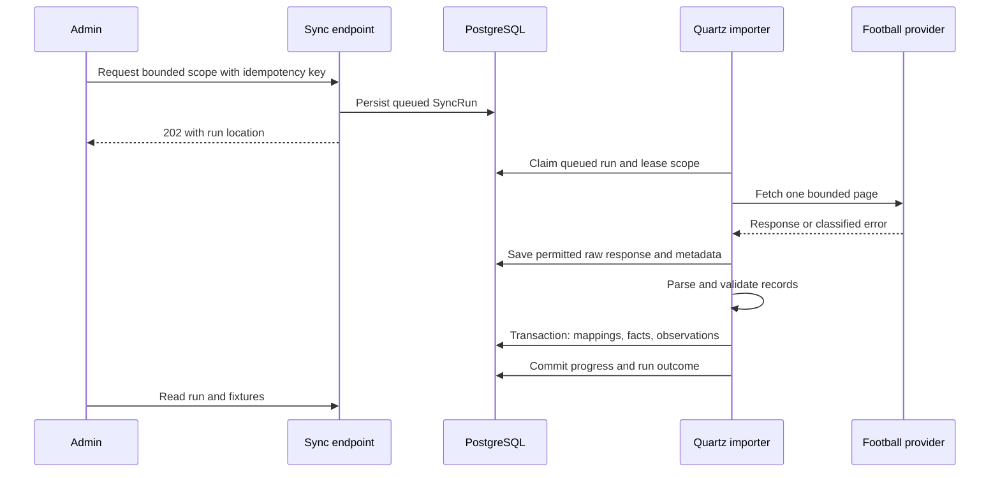

# Provider integration

`IFootballDataProvider` belongs to Data Acquisition's application boundary. Its adapter alone knows API-Football DTOs, authentication, pagination and status strings. It returns provider-neutral import records with explicit source metadata; the importer submits Football-owned commands through the Football facade.

## Import sequence

The database run is the durable work request. A Quartz dispatcher finds queued runs, so a crash between API persistence and scheduling does not lose work. A lease/heartbeat lets the dispatcher recover abandoned runs. Persistent Quartz scheduling is not sufficient on its own for domain idempotency.

## Contracts and scope

Provider operations initially cover team identity, selected competitions/seasons and date-bounded fixtures. Import opponents required by those fixtures. Requests include configured provider team/competition keys, season, date range and page/cursor where applicable. Results include normalized records, provider/external identity, fetched time, provider update time if available, parser version, pagination completion and quota metadata if supplied.

No provider IDs are embedded in generic domain types or public fixture URLs. Operator configuration resolves mappings deliberately; no hardcoded Real Madrid ID or fuzzy name merge. The adapter must verify actual provider endpoints, status/score semantics, plan coverage, pagination and quotas against current official documentation during implementation. Phase Zero makes no claim that a particular paid plan supplies xG, injuries, lineups or historical observations.

## Consistency and failure handling

1. Validate request scope and enforce configured page, date and request budgets before network work.
2. Acquire a bounded lease for equivalent scope. Use fixture-level database transaction locks and mapping uniqueness for overlapping scopes; do not rely solely on a process mutex.
3. Capture the permitted response and sanitized metadata outside the canonical mutation transaction.
4. Validate IDs, participants, competition/season, dates, score components and supported states. Missing is not zero. Unknown status is visible as Unknown with a warning. Quarantine invalid records with ImportError.
5. Resolve typed mappings and apply each coherent fixture with its required references, observation and current projection in one short transaction. Prior successful records remain committed if a later page fails; report PartiallySucceeded.
6. Compare source revision time if reliable; otherwise use deterministic request-start/fetch ordering and serialized fixture processing to stop an older in-flight response replacing newer knowledge. A changed source value in a later poll can still be a valid correction. Store comparison policy/version, warn on conflicting revisions, and document that absent source timestamps cannot prove source freshness.
7. Identical normalized values may reuse the current observation and update last-seen sync metadata. Changed values append an observation. Replays do not advance availability of the original observation or create duplicate fixtures.
8. Checkpoint pages only after canonical commits. Retry safely after crashes between commit and checkpoint; unique mapping keys and content comparison prevent duplication.

Retry timeouts, transient transport errors, 429 and selected 5xx responses with bounded exponential backoff and jitter; respect Retry-After and configured quota ceilings. Do not retry invalid credentials or deterministic schema errors blindly. Timeouts, total attempts and elapsed budgets are configurable. Exhaustion is a visible terminal/partial outcome, never a silent empty success. Stop on invalid pagination or repeated cursors. No secrets or response bodies in logs.

## Freshness, storage and recovery

Fixtures expose latest successful observation time separately from latest sync attempt. Failure leaves prior facts readable with stale/failed-refresh indicators. v0.1 uses operator-triggered bounded imports; scheduling can reuse the same use case after quota/cadence decisions. No continuous live refresh guarantee.

Raw JSONB is acceptable for bounded v0.1 responses. Retention and usage rights must be configured before real capture; retain audit metadata when bodies expire. Historical model evidence must remain reproducible through legally retainable normalized snapshots/artifact bundles, with explicit limitations if source retention is constrained. Never claim that raw payload storage alone makes an entire model reproducible.
