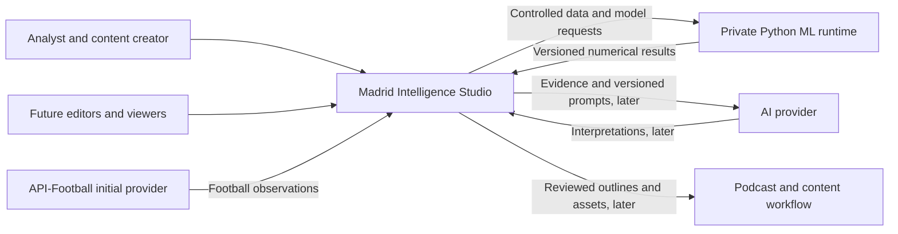

# System context

MIS is the application boundary. Football providers supply observations; ML computes from controlled inputs; AI providers generate interpretations. None determines editorial truth or directly modifies canonical business data.

The browser crosses an authenticated application boundary. API-Football and future AI providers are untrusted external inputs and availability dependencies. Python is a private compute boundary. PostgreSQL is the business system of record and is accessed through the .NET application. No browser holds provider secrets or directly calls Python.

v0.1 activates the analyst, application, and football-provider paths. Other paths show the target architecture without requiring empty modules or services now. External publishing is future work, requiring explicit user action and integration design.
