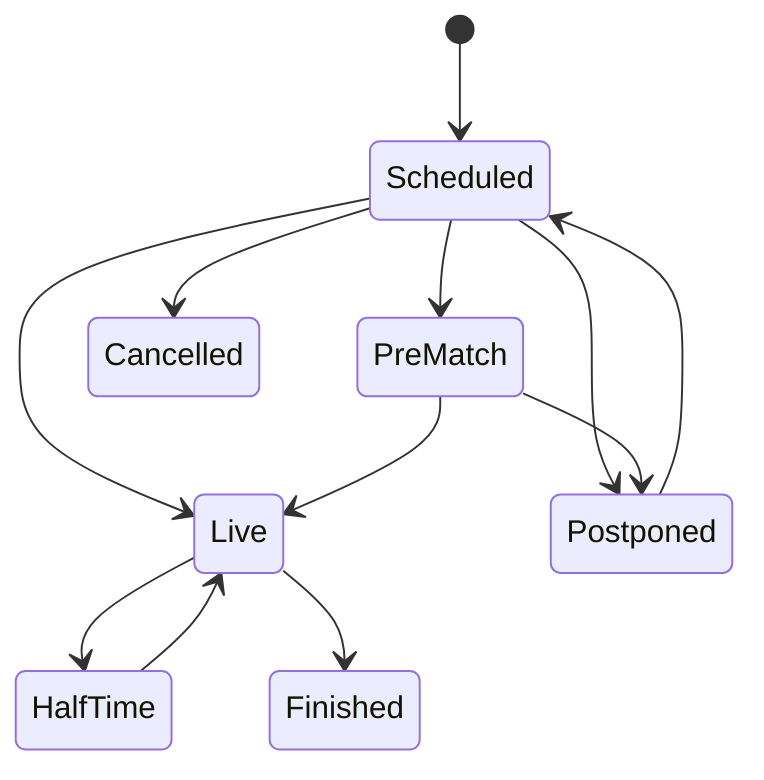

# Initial domain model

## v0.1 aggregates

- **Team**: canonical ID, display name, optional country/provider logo reference. Focus is configuration, not a property intrinsic to the team.
- **Competition**: identity, name, optional country/type. **Season** belongs to Competition, with provider-independent label and optional date bounds.
- **Fixture**: competition season, home/away team IDs, nullable kickoff UTC, canonical status, nullable score components, current accepted observation reference, concurrency version. Unknown kickoff or score remains null. Home and away differ. Venue is optional and can be added when needed.
- **Provider mappings**: one typed mapping per team, competition, season, or fixture. External IDs are strings scoped to provider and documented provider identity semantics. Do not fuzzy-merge teams by name.
- **SyncRun**: requested scope, status, requester, timestamps, progress/error counts, heartbeat. Queued → Running → Succeeded, PartiallySucceeded, Failed, or Cancelled. Retrying creates an attempt linked to the same requested work.
- **RawPayload / ImportError / FixtureObservation**: acquisition audit. Observations append accepted normalized records with source references; fixture rows represent the current projection.

Fixture status is `Scheduled`, `PreMatch`, `Live`, `HalfTime`, `Finished`, `Postponed`, `Cancelled`, or `Unknown`. `Unknown` preserves unsupported provider states without falsely claiming a match ended. Keep raw provider status in acquisition evidence. Regulation, extra-time, and shootout scores remain distinct nullable values; a single ambiguous total cannot settle a regulation market.

This diagram is the common path, not a strict provider transition validator. Imports may first see a finished fixture or skip half-time. Suspended/abandoned/unmapped states require an explicit adapter policy, otherwise map to Unknown. Accept validated source corrections with a new observation, record the reason, and never apply a simplistic monotonic status ranking. Concurrent/stale runs must not overwrite a newer accepted observation.

## Future aggregates and invariants

| Owner | Aggregate / concept | Key responsibility |
|---|---|---|
| Football | Player, Coach, Venue, Lineup, MatchEvent, Team/PlayerMatchStatistics, Standing, Injury, Suspension | Attributed football observations and corrected current projections |
| Intelligence | FormSnapshot, MatchAnalysis, TacticalProfile, MatchInsight | Calculation version, evidence, applicable window; distinguish expected vs confirmed lineup |
| Predictions | PredictionModel / ModelVersion | Immutable artifact identity, training cutoff, code/configuration and dependencies |
| Predictions | FeatureSnapshot / PredictionRun / MatchPrediction | Freeze evidence, execute, persist successful results exactly once |
| Predictions | SimulationRun / BacktestRun / Evaluation | Seeds and settings; chronological evaluation tied to actual-data revision |
| Betting | OddsSnapshot / ValueAssessment | Timestamped prices and model comparison, explicit market rules |
| Notebook | MatchNote | Minute/second, wall-clock capture, period, tags, players, importance, clip candidate; corrections append revisions |
| Tactics | TacticalScene | Stable schema version, normalized geometry, fixture reference; invalid geometry rejected |
| Content | PodcastEpisode / Segment / ScriptRevision | Pre/post-match outline, evidence links, human approval and versions |
| AI | PromptTemplateVersion / AIExecution | Provider/model, exact template version, inputs/references, output, duration, usage/cost if known |

Keep entities relational by default. Variable raw payloads and versioned scene state justify JSONB; generic business entities do not. Model feature values use typed records and definitions, not an ungoverned JSON bag. Model/data artifacts live in object storage when large.

Detailed invariants and enforcement are in [invariants](invariants.md); persistence relationships are in the [ER model](er-model.md).
