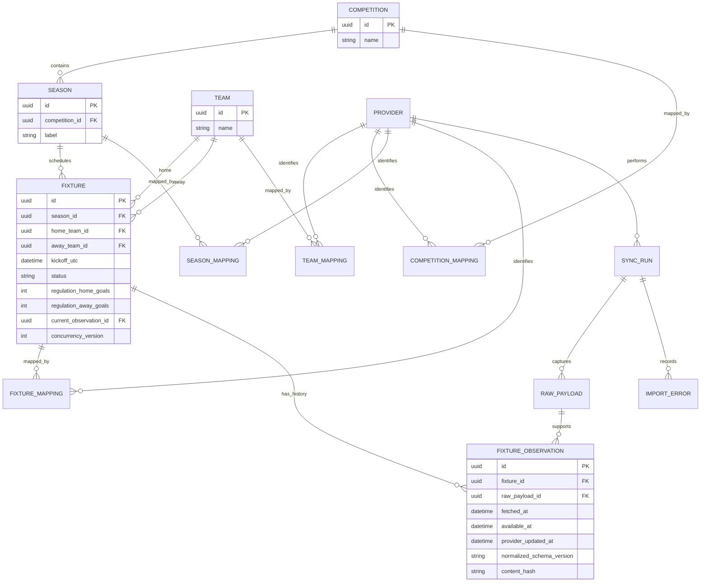
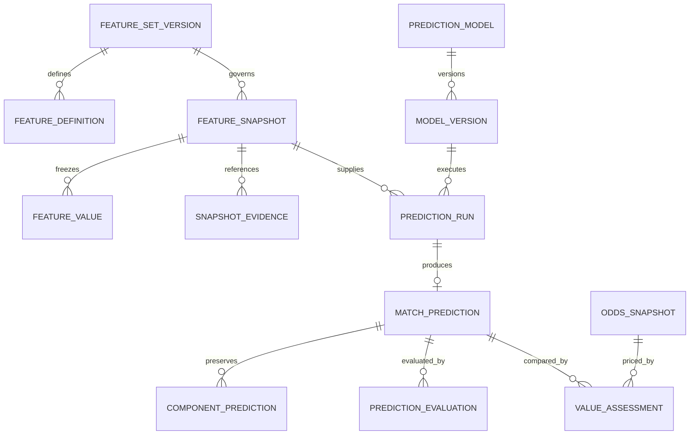

# Initial ER model

This is a logical design, not an executable migration. v0.1 tables come first. All `id` fields are canonical UUIDs; timestamps are UTC (`timestamptz`); scores are nullable nonnegative integers. FK deletion is restricted for retained history.

## v0.1 columns and constraints beyond the diagram

| Table / schema | Required details and constraints |
|---|---|
| `football.competition`, `season`, `team` | Names are not unique identities. Season unique `(competition_id, label)` under configured canonical labeling policy. Store source observation/reference metadata for imported identity fields. |
| `football.fixture` | FK participants/season, check distinct teams, paired nullable scores, optional extra-time/shootout components, current observation reference, last successful seen time and run ID (independent of immutable observation availability). Stable identity despite kickoff changes. Never deduplicate solely by team/date. |
| `acquisition.provider` | Unique provider code; no credentials in row. |
| `acquisition.*_mapping` | Typed FKs; unique `(provider_id, external_id)` for team/competition/fixture. Season key `(provider_id, external_competition_id, external_season_id)` because season labels may repeat across competitions. Keep mappings immutable except explicit audited repair. |
| `acquisition.sync_run` | Scope fingerprint, idempotency key/request hash, state, attempts, requested/started/completed times, heartbeat, counts and sanitized failure codes. One active run per equivalent scope; overlapping fixture scopes also use resource locking/concurrency checks. |
| `acquisition.raw_payload` | Run FK, endpoint/resource, sanitized query scope, page, request-start and fetched times, status, parser version, checksum, JSONB body initially, parse outcome. Persist permitted bodies only, never auth headers. Body may expire under retention policy; metadata remains. |
| `acquisition.fixture_observation` | Fixture/payload FKs, normalized values including season/participants, kickoff, status and all known score components, provider timestamps if supplied, receipt and availability times, parser/schema versions, content hash. Typed stable fields, immutable accepted observations. |
| `acquisition.import_error` | Run FK, optional payload FK, record external ID, sanitized code/message, retryability. Invalid records do not enter canonical tables. |

The fixture→current observation FK and observation→fixture FK form an intentional insertion cycle: create fixture with a temporarily null current reference, append observation, set reference within one transaction. Composite ownership constraint `(fixture_id, observation_id)` prevents referencing another fixture's observation. No accepted existing fixture loses its reference. EF migrations must prove this behavior in PostgreSQL.

Start with indexes on fixture `(kickoff_utc, id)`, `(home_team_id, kickoff_utc, id)`, `(away_team_id, kickoff_utc, id)`, and `(season_id, kickoff_utc, id)`; mapping unique keys; observations `(fixture_id, available_at, id)`; runs `(state, requested_at)`. Validate plans against the actual paginated query before adding more.

## Prediction extension: design now, tables from v0.3

ModelVersion includes immutable artifact digest, code revision, environment lock digest, training dataset manifest/cutoff, hyperparameters and calibration version. FeatureSnapshot includes fixture ID, feature-set version, cutoff, creation time, evidence/values digest and kickoff as known. SnapshotEvidence links immutable observation IDs and their hashes; large evidence bundles use versioned object references. FeatureValue is unique `(snapshot_id, feature_definition_id)` with typed value or explicit missing reason.

MatchPrediction records fixture, run, model/version, feature-set version, snapshot ID, GeneratedAt, InputDataCutoff, three probabilities, nullable expected goals until supported, confidence diagnostic and data quality. A run yields at most one immutable success. Validate that fixture, model/version, feature-set version and snapshot references agree with the run; use composite constraints where practical, plus contract/integration tests. Store market period explicitly. ComponentPrediction preserves every ensemble member output and weight. SimulationRun stores prediction reference, seed, algorithm, sample count or truncation rule and distribution artifact/hash.

PredictionEvaluation records prediction ID, actual observation ID, evaluation code version, result-period rules, and metrics. Corrected actuals create a new evaluation. OddsSnapshot includes bookmaker, fixture, market/period/line, selection prices, observed and captured times. ValueAssessment references exact prediction and odds IDs plus calculation version. Do not cascade-delete any of these records through fixture/model changes.

