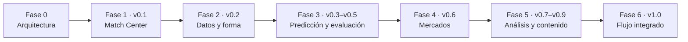

# Fases de ejecución

Esta secuencia transforma la visión de MIS en entregas verificables. Cada fase termina con una revisión de calidad, integridad de datos y documentación antes de abrir la siguiente. No se construyen módulos futuros de forma anticipada.

| Fase | Versiones | Resultado que habilita | Condición para avanzar |
|---|---|---|---|
| 0. Arquitectura | — | Límites, modelo de dominio, contratos, riesgos y backlog coherentes | Revisión crítica completada; no hay contradicciones que bloqueen el primer slice |
| 1. Centro de partidos | v0.1 | Un analista importa datos permitidos y abre un partido en la web | Flujo API-Football → PostgreSQL → API → UI probado; importación idempotente, observable y segura |
| 2. Datos y forma | v0.2 | Estadísticas y forma reciente con procedencia | Fórmulas versionadas, datos incompletos visibles y métricas sin fuga temporal |
| 3. Predicción y evaluación | v0.3–v0.5 | Probabilidades, simulaciones y comparación honesta con resultados | Snapshots/modelos inmutables; backtest cronológico, calibración y evaluación reproducible |
| 4. Inteligencia de mercado | v0.6 | Comparación entre modelo y cuotas | Cuotas con tiempo/mercado definidos; evaluaciones pasadas no se modifican |
| 5. Análisis y contenido | v0.7–v0.9 | Notas en vivo, guiones y pizarra táctica | Notas y escenas trazables; IA separada de hechos y revisión editorial humana |
| 6. Flujo integrado | v1.0 | Flujo completo prepartido, directo y postpartido | Seguridad, recuperación, observabilidad y recorridos críticos validados |

## Fase 0 — Arquitectura y producto

Completada. Define el sistema como monolito modular en .NET, PostgreSQL como sistema de registro y una frontera privada para Python cuando exista modelado. La evidencia del diseño está en el [índice de documentación](../README.md) y la revisión está en [Phase Zero review](../architecture/phase-zero-review.md).

## Fase 1 — Match Center Foundation

Es la única fase de implementación que debe comenzar ahora. Su objetivo es demostrar un flujo completo, no crear una maqueta del producto final.

1. Crear la base mínima del monorepo: API .NET, web Next.js, PostgreSQL local, configuración segura y comandos documentados.
2. Persistir Football y Data Acquisition con IDs canónicos, mapeos de proveedor, ejecuciones de sincronización y observaciones inmutables.
3. Validar la cobertura, cuota y derechos de API-Football antes de capturar datos reales.
4. Importar un alcance acotado de competiciones, temporadas y partidos del equipo configurado, incluyendo rivales necesarios.
5. Exponer contratos REST/OpenAPI para lista, detalle de fixture y seguimiento de sincronización.
6. Mostrar lista de partidos y Match Center básico con estado, marcador por periodo y frescura de los datos.
7. Validar arquitectura, PostgreSQL real, UI, recorrido E2E, observabilidad y una sincronización real permitida.

Las tareas MC-01 a MC-08 y sus criterios de aceptación están en el [backlog detallado](implementation-backlog.md).

## Fase 2 — Datos y forma

Incorpora estadísticas de equipo por partido, forma reciente y métricas móviles. Cada valor derivado incluye fórmula, ventana, versión y referencias a hechos importados. Esta fase habilita análisis descriptivo, pero no predicciones todavía.

## Fase 3 — Predicción y evaluación

Primero añade Elo con probabilidades de victoria/empate/derrota y evaluación temporalmente correcta. Después incorpora Poisson y Dixon-Coles para goles y simulación. Finalmente muestra rendimiento histórico, Brier Score, Log Loss y calibración. El runtime Python se activa aquí, usando únicamente entradas congeladas y versionadas.

## Fase 4 — Inteligencia de mercado

Registra snapshots de cuotas manuales o procedentes de integraciones permitidas. Calcula probabilidades implícitas, normalizadas y diferencia con el modelo. No coloca apuestas ni convierte una opinión futbolística en una recomendación automática.

## Fase 5 — Análisis y contenido

El Match Notebook permite registrar observaciones rápidas y trazables. Content Studio produce borradores pre y postpartido con evidencia. Tactical Studio guarda escenas con coordenadas normalizadas. La IA puede agrupar o redactar, pero sus interpretaciones permanecen separadas de los hechos y requieren revisión humana.

## Fase 6 — Flujo integrado

Une el ciclo del analista: preparar partido, capturar notas en vivo, sincronizar datos finales, comparar predicción contra realidad y producir contenido. Antes de considerar esta fase terminada se prueban recuperación, permisos, conservación de evidencia y recorridos críticos de extremo a extremo.

## Puertas de decisión

Antes de datos reales: resolver cobertura, cuota y retención del proveedor (ADR-010). Antes de acceso compartido: resolver identidad y roles (ADR-009). Antes de Azure: resolver infraestructura, respaldo y costos (ADR-011). Estas decisiones no bloquean la preparación local de la Fase 1.
